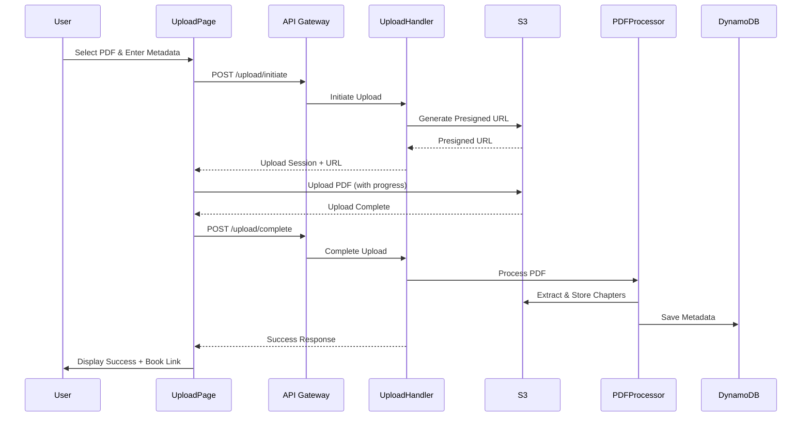

# Design Document: PDF Upload UI

## Overview

This design describes a web-based PDF upload interface for the AI Digital Library. The solution extends the existing CLI upload functionality to provide a user-friendly web interface. Users will be able to upload PDF files, provide metadata, and receive real-time feedback on upload and processing progress.

The design follows a client-side upload pattern using S3 presigned URLs for efficient file transfer, with backend Lambda functions handling PDF processing, text extraction, and metadata storage. This approach minimizes backend processing time and provides better progress feedback to users.

## Architecture

### High-Level Flow



### Component Architecture

The system consists of three main layers:

1. **Frontend Layer** (React + TypeScript)
   - Upload form component for file selection and metadata input
   - Progress indicator component for visual feedback
   - File validation logic
   - S3 direct upload with progress tracking

2. **API Layer** (AWS Lambda + API Gateway)
   - Upload initiation endpoint (generates presigned URLs)
   - Upload completion endpoint (triggers processing)
   - Existing book retrieval endpoints (reused)

3. **Processing Layer** (Backend Services)
   - PDF text extraction service
   - Chapter splitting logic
   - S3 storage management
   - DynamoDB metadata persistence

## Components and Interfaces

### Frontend Components

#### UploadPage Component

**Location:** `frontend/src/pages/UploadPage.tsx`

**Responsibilities:**
- Render upload form with file input and metadata fields
- Coordinate upload workflow (initiate → upload → complete)
- Display progress and error states
- Navigate to book page on success

**State:**
```typescript
interface UploadState {
  file: File | null;
  metadata: BookMetadata;
  uploadSession: UploadSession | null;
  uploadProgress: number;
  processingStatus: 'idle' | 'uploading' | 'processing' | 'complete' | 'error';
  errorMessage: string | null;
  uploadedBookId: string | null;
}
```

**Key Methods:**
- `handleFileSelect(file: File): void` - Validates and sets selected file
- `handleMetadataChange(field: string, value: any): void` - Updates metadata fields
- `initiateUpload(): Promise<void>` - Calls API to get presigned URL
- `uploadToS3(presignedUrl: string): Promise<void>` - Uploads file with progress tracking
- `completeUpload(): Promise<void>` - Notifies backend to process PDF
- `resetForm(): void` - Clears form for new upload

#### FileUploadInput Component

**Location:** `frontend/src/components/FileUploadInput.tsx`

**Responsibilities:**
- Render file input with drag-and-drop support
- Display selected file information
- Show file validation errors

**Props:**
```typescript
interface FileUploadInputProps {
  onFileSelect: (file: File) => void;
  accept: string;
  maxSizeMB: number;
  error: string | null;
}
```

#### ProgressIndicator Component

**Location:** `frontend/src/components/ProgressIndicator.tsx`

**Responsibilities:**
- Display upload progress bar
- Show current processing stage
- Animate transitions between stages

**Props:**
```typescript
interface ProgressIndicatorProps {
  stage: 'uploading' | 'processing' | 'complete';
  progress: number; // 0-100
  message: string;
}
```

### Backend Components

#### Upload Handler Lambda

**Location:** `backend/src/lambdas/upload-handler.ts`

**Endpoints:**

1. **POST /upload/initiate**
   - Validates metadata
   - Generates unique bookId and uploadId
   - Creates presigned S3 URL for PDF upload
   - Returns upload session data

   **Request:**
   ```typescript
   {
     filename: string;
     fileSize: number;
     metadata: {
       title: string;
       author: string;
       description: string;
       topics: string[];
       difficulty: 'beginner' | 'intermediate' | 'advanced';
       publicationYear?: number;
       coverImage?: string;
     }
   }
   ```

   **Response:**
   ```typescript
   {
     uploadId: string;
     bookId: string;
     presignedUrl: string;
     expiresIn: number; // seconds
   }
   ```

2. **POST /upload/complete**
   - Verifies PDF exists in S3
   - Triggers PDF processing
   - Returns processing status

   **Request:**
   ```typescript
   {
     uploadId: string;
     bookId: string;
   }
   ```

   **Response:**
   ```typescript
   {
     bookId: string;
     status: 'processing' | 'complete';
     message: string;
   }
   ```

#### PDF Processor Service

**Location:** `backend/src/services/pdf-processor.ts`

**Responsibilities:**
- Extract text from PDF files
- Determine page count
- Split content into chapters
- Upload chapters to S3
- Create and save book metadata

**Key Functions:**

```typescript
async function processPDF(bookId: string, metadata: BookMetadata): Promise<Book>
```
- Main orchestration function
- Calls text extraction, chapter splitting, and storage functions
- Returns complete book object

```typescript
async function extractTextFromPDF(s3Key: string): Promise<string>
```
- Downloads PDF from S3
- Uses pdf-parse library for text extraction
- Returns extracted text or empty string on failure

```typescript
async function getPDFPageCount(s3Key: string): Promise<number>
```
- Downloads PDF from S3
- Extracts page count from PDF metadata
- Returns page count

```typescript
function splitTextIntoChapters(text: string, totalPages: number, pagesPerChapter: number): string[]
```
- Divides text into equal portions based on page count
- Returns array of chapter text strings

```typescript
async function uploadChapters(bookId: string, chapterTexts: string[], totalPages: number): Promise<Chapter[]>
```
- Uploads each chapter to S3
- Generates chapter metadata
- Returns array of chapter objects

```typescript
async function saveBookMetadata(book: Book): Promise<void>
```
- Saves complete book record to DynamoDB
- Includes all metadata and chapter information

### Data Models

#### Book

```typescript
interface Book {
  bookId: string;              // Unique identifier: book-{timestamp}
  title: string;               // Book title
  author: string;              // Author name
  description: string;         // Book description
  topics: string[];            // Array of topic tags
  difficulty: 'beginner' | 'intermediate' | 'advanced';
  publicationYear?: number;    // Optional publication year
  coverImage?: string;         // Optional cover image URL
  s3Key: string;               // S3 key for original PDF
  pdfUrl: string;              // Same as s3Key for compatibility
  chapters: Chapter[];         // Array of chapter objects
  totalPages: number;          // Total page count
  createdAt: string;           // ISO timestamp
  updatedAt: string;           // ISO timestamp
}
```

#### Chapter

```typescript
interface Chapter {
  chapterId: string;           // Format: chapter-{N}
  chapterNumber: number;       // Sequential number starting at 1
  title: string;               // Chapter title (default: "Chapter {N}")
  s3Key: string;               // S3 key for chapter text
  pageCount: number;           // Number of pages in chapter
}
```

#### UploadSession

```typescript
interface UploadSession {
  uploadId: string;            // Unique upload identifier
  bookId: string;              // Associated book ID
  presignedUrl: string;        // S3 presigned URL
  expiresAt: string;           // Expiration timestamp
  metadata: BookMetadata;      // User-provided metadata
  status: 'initiated' | 'uploaded' | 'processing' | 'complete' | 'failed';
}
```

#### BookMetadata

```typescript
interface BookMetadata {
  title: string;
  author: string;
  description: string;
  topics: string[];
  difficulty: 'beginner' | 'intermediate' | 'advanced';
  publicationYear?: number;
  coverImage?: string;
}
```

### File Validation Rules

**Client-Side Validation:**
- File extension must be `.pdf`
- File size must not exceed 50MB (52,428,800 bytes)
- All required metadata fields must be non-empty
- Publication year must be 4 digits between 1000 and current year
- Cover image URL must be valid URL format (if provided)

**Server-Side Validation:**
- Verify file exists in S3 after upload
- Verify file size matches reported size
- Validate metadata structure and types

### Error Handling Strategy

**Client-Side Errors:**
- File validation errors: Display inline error messages
- Network errors: Display retry button with error message
- Form validation errors: Highlight invalid fields

**Server-Side Errors:**
- S3 upload failures: Return 500 with retry guidance
- PDF processing failures: Log error, save book with empty chapters
- DynamoDB failures: Return 500, do not mark upload as complete

**Error Recovery:**
- Failed uploads can be retried without re-entering metadata
- Processing failures are logged but don't block book creation
- Books with processing failures are created with placeholder chapter content


## Correctness Properties

A property is a characteristic or behavior that should hold true across all valid executions of a system—essentially, a formal statement about what the system should do. Properties serve as the bridge between human-readable specifications and machine-verifiable correctness guarantees.

### Property Reflection

After analyzing all acceptance criteria, several properties can be consolidated:
- Properties 1.2 and 9.1/9.2 all test file size validation - can be combined into one comprehensive property
- Properties 2.1 and 2.6 both test required field validation - can be combined
- Properties 4.1, 4.2, 4.3, 4.4 all test state transitions - can be combined into one state machine property
- Properties 6.2 and 6.4 both test data structure completeness - can be combined
- Properties 8.1 and 8.2 both test chapter numbering - can be combined

### File Validation Properties

Property 1: PDF Extension Validation
*For any* file with a given filename, the File_Validator should accept the file if and only if the filename ends with ".pdf" (case-insensitive)
**Validates: Requirements 1.1**

Property 2: File Size Validation
*For any* file, the File_Validator should reject files larger than 50MB (52,428,800 bytes) and display the error message "File size exceeds 50MB limit. Please upload a smaller file."
**Validates: Requirements 1.2, 9.1, 9.2**

Property 3: Validation Before Upload
*For any* upload attempt, file validation (extension and size checks) should complete before any S3 upload is initiated
**Validates: Requirements 9.3**

### Metadata Validation Properties

Property 4: Required Fields Validation
*For any* form submission attempt, the Upload_Form should prevent submission and highlight missing fields when any of the required fields (title, author, description) are empty or contain only whitespace
**Validates: Requirements 2.1, 2.6**

Property 5: Topics Array Handling
*For any* array of topic strings, the Upload_Form should accept and store all provided topics without loss or modification
**Validates: Requirements 2.2**

Property 6: Difficulty Value Validation
*For any* difficulty value, the Upload_Form should accept it if and only if it is one of: "beginner", "intermediate", or "advanced"
**Validates: Requirements 2.3**

Property 7: Publication Year Validation
*For any* optional publication year value, if provided, the Upload_Form should accept it if and only if it is a four-digit integer between 1000 and the current year (inclusive)
**Validates: Requirements 2.4**

Property 8: Cover Image URL Validation
*For any* optional cover image value, if provided, the Upload_Form should accept it if and only if it is a valid URL format (starts with http:// or https://)
**Validates: Requirements 2.5**

### Upload Workflow Properties

Property 9: Presigned URL Generation
*For any* valid upload initiation request, the Upload_Handler should return a response containing a presigned URL, bookId, and uploadId
**Validates: Requirements 1.4**

Property 10: Progress Calculation
*For any* upload with total size S and bytes transferred B, the progress percentage should equal floor((B / S) * 100) and be between 0 and 100 inclusive
**Validates: Requirements 1.5**

Property 11: Upload State Machine
*For any* upload session, the state transitions should follow the sequence: idle → uploading → processing → complete, with each transition triggered by the appropriate event (file selected, upload started, upload finished, processing finished)
**Validates: Requirements 4.1, 4.2, 4.3, 4.4**

Property 12: Processing Trigger
*For any* completed S3 upload, calling the complete endpoint should trigger the PDF_Processor to begin processing
**Validates: Requirements 3.1**

### PDF Processing Properties

Property 13: Text Extraction Attempt
*For any* PDF file in S3, the PDF_Processor should attempt to extract text content, and if extraction fails, should continue with empty chapter content rather than failing the entire upload
**Validates: Requirements 3.2, 3.3**

Property 14: Page Count Extraction
*For any* PDF file, the PDF_Processor should extract and return a page count that is a positive integer
**Validates: Requirements 3.4**

Property 15: Chapter Count Calculation
*For any* PDF with page count P and pages-per-chapter value C (default 10), the number of chapters created should equal ceil(P / C)
**Validates: Requirements 3.5, 8.3**

Property 16: Chapter S3 Key Pattern
*For any* chapter N of book with bookId B, the S3 key should match the pattern "books/{B}/chapters/chapter-{N}.txt" where N is the chapter number
**Validates: Requirements 3.6**

Property 17: Chapter Numbering
*For any* set of chapters created for a book, the chapter numbers should form a consecutive sequence starting at 1, and each chapter title should be "Chapter {N}" where N is the chapter number
**Validates: Requirements 8.1, 8.2**

### Data Persistence Properties

Property 18: Book Record Creation
*For any* successfully processed upload, a book record should be created in DynamoDB with a unique bookId in the format "book-{timestamp}"
**Validates: Requirements 6.1**

Property 19: Book Record Completeness
*For any* book record saved to DynamoDB, it should contain all required fields: bookId, title, author, description, topics, difficulty, s3Key, chapters, totalPages, createdAt, updatedAt, and optional fields publicationYear and coverImage if provided
**Validates: Requirements 6.2, 6.4**

Property 20: PDF S3 Key Format
*For any* book with bookId B, the original PDF S3 key should be "books/{B}/original.pdf"
**Validates: Requirements 6.3**

Property 21: Timestamp Format
*For any* book record, both createdAt and updatedAt fields should be valid ISO 8601 timestamp strings representing the time of creation
**Validates: Requirements 6.5**

### Error Handling Properties

Property 22: Validation Error Messages
*For any* validation failure, the Upload_Form should display a specific error message that describes which validation rule failed
**Validates: Requirements 5.1**

Property 23: Form State Persistence on Error
*For any* error that occurs during upload or processing, the Upload_Form should retain all user-entered metadata values to allow retry without re-entry
**Validates: Requirements 5.5**

### Success State Properties

Property 24: Success Message Content
*For any* successfully completed upload, the success message should include the book title and provide both a "View Book" link to /book/{bookId} and an "Upload Another" button
**Validates: Requirements 4.5, 10.1, 10.2, 10.3**

Property 25: Form Reset
*For any* form in a success or error state, clicking "Upload Another" should reset all form fields to their initial empty state and clear any error messages
**Validates: Requirements 10.4**

## Error Handling

### Client-Side Error Handling

**File Validation Errors:**
- Invalid file extension: "Please select a PDF file"
- File too large: "File size exceeds 50MB limit. Please upload a smaller file."
- No file selected: "Please select a file to upload"

**Form Validation Errors:**
- Missing required fields: Highlight fields in red with message "This field is required"
- Invalid publication year: "Publication year must be between 1000 and {currentYear}"
- Invalid cover image URL: "Please enter a valid URL starting with http:// or https://"

**Upload Errors:**
- Network failure: "Connection lost. Please check your network and retry."
- S3 upload failure: "Upload failed. Please try again."
- Timeout: "Upload timed out. Please try again with a smaller file or better connection."

**Processing Errors:**
- PDF processing failure: "Processing failed. The PDF may be corrupted or invalid."
- Metadata save failure: "Failed to save book information. Please try again."

### Server-Side Error Handling

**Upload Initiation Errors:**
- Invalid metadata: Return 400 with field-specific error messages
- File size exceeds limit: Return 400 with "File size exceeds maximum allowed size"
- S3 presigned URL generation failure: Return 500 with "Failed to initiate upload"

**Upload Completion Errors:**
- PDF not found in S3: Return 404 with "Uploaded file not found"
- Invalid upload session: Return 400 with "Invalid or expired upload session"
- Processing failure: Return 500 but still create book record with empty chapters

**PDF Processing Errors:**
- Text extraction failure: Log warning, continue with empty chapter content
- Page count extraction failure: Default to 1 page, create single chapter
- S3 upload failure for chapters: Retry up to 3 times, then fail processing
- DynamoDB save failure: Retry up to 3 times, then return 500

### Error Recovery Strategies

**Retry Logic:**
- S3 operations: Retry up to 3 times with exponential backoff
- DynamoDB operations: Retry up to 3 times with exponential backoff
- PDF processing: No automatic retry, user must retry upload

**Graceful Degradation:**
- If text extraction fails, create book with placeholder chapter content
- If page count extraction fails, default to 1 page and single chapter
- If cover image URL is invalid, save book without cover image

**User Guidance:**
- All error messages include actionable guidance
- Retry buttons are provided for transient failures
- Form data is preserved to minimize re-entry effort

## Testing Strategy

### Dual Testing Approach

This feature requires both unit tests and property-based tests for comprehensive coverage:

**Unit Tests** focus on:
- Specific examples of valid and invalid inputs
- Integration between components (form submission → API call → S3 upload)
- Edge cases like empty files, maximum size files, special characters in metadata
- Error conditions and error message content
- UI state transitions for specific scenarios

**Property-Based Tests** focus on:
- Universal properties that hold for all inputs (validation rules, calculations)
- Comprehensive input coverage through randomization
- Invariants that must hold regardless of input (data structure completeness, key formats)
- State machine properties (upload workflow transitions)

Together, these approaches provide comprehensive coverage: unit tests catch concrete bugs in specific scenarios, while property tests verify general correctness across all possible inputs.

### Property-Based Testing Configuration

**Library:** fast-check (JavaScript/TypeScript property-based testing library)

**Configuration:**
- Minimum 100 iterations per property test
- Each test tagged with feature name and property number
- Tag format: `// Feature: pdf-upload-ui, Property {N}: {property description}`

**Example Property Test Structure:**
```typescript
import fc from 'fast-check';

// Feature: pdf-upload-ui, Property 1: PDF Extension Validation
test('accepts files with .pdf extension and rejects others', () => {
  fc.assert(
    fc.property(
      fc.string(), // Generate random filenames
      (filename) => {
        const isPdf = filename.toLowerCase().endsWith('.pdf');
        const result = validateFileExtension(filename);
        expect(result.valid).toBe(isPdf);
      }
    ),
    { numRuns: 100 }
  );
});
```

### Test Coverage Requirements

**Frontend Components:**
- UploadPage: State management, workflow orchestration, error handling
- FileUploadInput: File selection, drag-and-drop, validation display
- ProgressIndicator: Progress calculation, stage transitions, visual states

**Backend Services:**
- Upload Handler: Presigned URL generation, upload session management
- PDF Processor: Text extraction, page counting, chapter splitting
- Validation: Metadata validation, file validation

**Integration Tests:**
- Complete upload workflow from file selection to book creation
- Error scenarios at each stage of the workflow
- S3 and DynamoDB interactions (using mocks or localstack)

### Testing Tools

- **Jest**: Unit test framework
- **fast-check**: Property-based testing library
- **React Testing Library**: Component testing
- **MSW (Mock Service Worker)**: API mocking for frontend tests
- **AWS SDK Mocks**: Mocking S3 and DynamoDB operations
