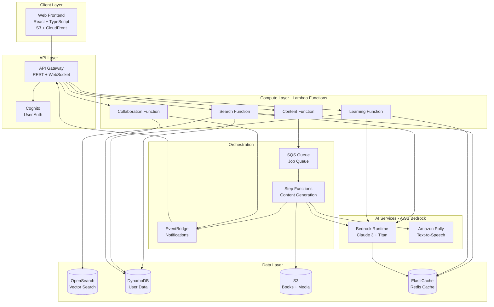

# Design Document: AI-Enabled Digital Library

## Overview

The AI-Enabled Digital Library is a web-based platform that combines traditional digital library functionality with advanced AI capabilities to help developers learn, reference, and create educational content. The system architecture follows a microservices pattern with three main layers:

1. **Presentation Layer**: Web frontend for user interactions
2. **Application Layer**: Core business logic and AI orchestration
3. **Data Layer**: Book storage, user data, and vector embeddings

The system leverages AWS services and AI technologies:
- **AWS Bedrock**: Primary AI service for LLMs (Claude 3, Titan) and embeddings (Titan Embeddings)
- **Amazon Polly**: Text-to-speech for video narration generation
- **AWS Lambda**: Serverless compute for API endpoints and async processing
- **Amazon S3**: Storage for books, generated videos, and presentations
- **Amazon DynamoDB**: NoSQL database for user data, sessions, and metadata
- **Amazon OpenSearch**: Vector database for semantic search with embeddings
- **Amazon SQS**: Message queue for async content generation jobs
- **Amazon EventBridge**: Event-driven architecture for notifications
- **AWS Step Functions**: Orchestration for complex content generation workflows

### Key Design Decisions

**Decision 1: AWS Bedrock for AI Services**
- **Rationale**: AWS Bedrock provides access to multiple foundation models (Claude 3, Titan, Jurassic) with a unified API, no infrastructure management, and built-in security/compliance. For a hackathon, this eliminates the complexity of managing multiple AI providers.
- **Trade-off**: Vendor lock-in vs. simplified integration and enterprise-grade security
- **Choice**: Use AWS Bedrock with Claude 3 Sonnet for content generation (best quality/cost ratio) and Titan Embeddings for semantic search (optimized for retrieval)

**Decision 2: Serverless Architecture with AWS Lambda**
- **Rationale**: Hackathon projects need to scale from 0 to 100 users without infrastructure management. Lambda provides automatic scaling, pay-per-use pricing, and fast deployment.
- **Trade-off**: Cold start latency vs. zero operational overhead
- **Choice**: Use Lambda for all API endpoints with provisioned concurrency for critical paths (search, authentication)

**Decision 3: Amazon OpenSearch for Vector Database**
- **Rationale**: OpenSearch natively supports vector search with k-NN algorithms and integrates seamlessly with other AWS services. Eliminates need for third-party vector databases.
- **Trade-off**: Learning curve vs. AWS ecosystem integration
- **Choice**: Use OpenSearch with k-NN plugin for semantic search, combining vector similarity with traditional filters

**Decision 4: AWS Step Functions for Content Generation**
- **Rationale**: Video and presentation generation involves multiple steps (content analysis → outline → generation → rendering → upload). Step Functions provides visual workflow orchestration with built-in error handling and retries.
- **Trade-off**: More complex setup vs. robust orchestration and observability
- **Choice**: Use Step Functions to orchestrate content generation with parallel execution where possible

**Decision 5: DynamoDB for User Data**
- **Rationale**: DynamoDB provides single-digit millisecond latency, automatic scaling, and seamless Lambda integration. Perfect for user profiles, sessions, and metadata.
- **Trade-off**: NoSQL limitations vs. performance and scalability
- **Choice**: Use DynamoDB for all user-facing data with GSIs for common query patterns

**Decision 6: Amazon SQS + EventBridge for Async Processing**
- **Rationale**: Content generation can take 30-60 seconds. SQS provides reliable message queuing, while EventBridge enables event-driven notifications.
- **Trade-off**: More components vs. decoupled, scalable architecture
- **Choice**: Use SQS for job queues and EventBridge to notify users via WebSocket (API Gateway WebSocket API)

## Architecture

### System Architecture Diagram



### AWS Service Justification

**Why AWS Bedrock?**
- Unified API for multiple foundation models (Claude 3, Titan, Jurassic-2)
- No infrastructure management - focus on application logic
- Built-in security with AWS IAM and encryption
- Cost-effective with pay-per-use pricing
- Enterprise-grade compliance (HIPAA, SOC 2, GDPR)

**Why Amazon OpenSearch?**
- Native vector search with k-NN algorithms
- Combines semantic search with traditional filtering
- Seamless integration with Lambda and other AWS services
- Managed service - no cluster management needed
- Built-in monitoring and alerting

**Why AWS Lambda?**
- Zero infrastructure management
- Automatic scaling from 0 to 1000s of requests
- Pay only for compute time used
- Fast deployment and iteration (critical for hackathons)
- Native integration with all AWS services

**Why DynamoDB?**
- Single-digit millisecond latency
- Automatic scaling with on-demand pricing
- Perfect for user profiles, sessions, and metadata
- Strong consistency options when needed
- Built-in backup and point-in-time recovery

**Why Step Functions?**
- Visual workflow orchestration
- Built-in error handling and retries
- Parallel execution for faster processing
- Easy to debug with execution history
- Integrates with all AWS services

**Why Amazon Polly?**
- High-quality neural text-to-speech
- Multiple voices and languages
- SSML support for fine-grained control
- Pay-per-character pricing
- Seamless integration with Lambda

### Component Interaction Flow

**Semantic Search Flow:**
1. User enters natural language query in frontend
2. API Gateway authenticates request and routes to Search Service
3. Search Service calls Embedding Service to convert query to vector
4. Embedding Service checks Redis cache, or calls OpenAI API
5. Search Service queries Vector DB with embedding
6. Search Service enriches results with metadata from PostgreSQL
7. Search Service returns ranked results to frontend

**Content Generation Flow:**
1. User requests video/presentation generation
2. API Gateway validates request and routes to Content Service
3. Content Service creates job in Redis queue and returns job ID
4. Worker process picks up job from queue
5. Worker calls LLM Service to analyze source material and create outline
6. Worker calls Video/Presentation Generator to create content
7. Worker uploads result to S3 and updates job status
8. WebSocket notifies frontend of completion
9. Frontend displays generated content with download link

## Components and Interfaces

### 1. Search Service

**Responsibility**: Handle all search-related operations including semantic search, query understanding, and result ranking.

**Interface:**
```typescript
interface SearchService {
  // Semantic search across all books
  searchBooks(query: string, userId: string, options: SearchOptions): Promise<SearchResult[]>
  
  // Search within a specific book
  searchInBook(query: string, bookId: string): Promise<BookSearchResult[]>
  
  // Get search suggestions as user types
  getSuggestions(partialQuery: string): Promise<string[]>
  
  // Record user interaction for learning
  recordInteraction(userId: string, searchId: string, interaction: Interaction): Promise<void>
}

interface SearchOptions {
  limit?: number
  offset?: number
  filters?: {
    topics?: string[]
    difficulty?: 'beginner' | 'intermediate' | 'advanced'
    publicationYear?: { min?: number, max?: number }
  }
}

interface SearchResult {
  bookId: string
  title: string
  author: string
  relevanceScore: number
  explanation: string  // AI-generated explanation of why this matches
  snippet: string      // Relevant excerpt
  topics: string[]
}
```

**Dependencies:**
- AWS Bedrock (Titan Embeddings for query vectorization)
- Amazon OpenSearch (for vector similarity search)
- DynamoDB (for metadata and user preferences)
- ElastiCache Redis (for caching results and embeddings)

**Key Algorithms:**
- Hybrid search: Combine vector similarity with keyword matching (weighted 70/30)
- Re-ranking: Use user's past interactions to personalize results
- Query expansion: Use LLM to identify synonyms and related terms

### 2. Content Service

**Responsibility**: Orchestrate AI-powered content generation including videos and presentations.

**Interface:**
```typescript
interface ContentService {
  // Generate explainer video
  generateVideo(request: VideoRequest): Promise<JobId>
  
  // Generate presentation
  generatePresentation(request: PresentationRequest): Promise<JobId>
  
  // Get generation job status
  getJobStatus(jobId: string): Promise<JobStatus>
  
  // Get generated content
  getGeneratedContent(contentId: string): Promise<GeneratedContent>
  
  // List user's generated content
  listUserContent(userId: string, type?: ContentType): Promise<GeneratedContent[]>
}

interface VideoRequest {
  userId: string
  topic: string
  sourceBookIds?: string[]  // Optional: specific books to use
  targetAudience: 'beginner' | 'intermediate' | 'advanced'
  duration?: number  // Target duration in seconds (120-300)
  focusAreas?: string[]  // Specific aspects to emphasize
}

interface PresentationRequest {
  userId: string
  topic: string
  sourceBookIds?: string[]
  targetAudience: 'beginner' | 'intermediate' | 'advanced'
  slideCount?: number  // Target number of slides (5-20)
  includeCode?: boolean
  includeDiagrams?: boolean
}

interface JobStatus {
  jobId: string
  status: 'queued' | 'processing' | 'completed' | 'failed'
  progress: number  // 0-100
  currentStage?: string  // e.g., "Analyzing content", "Generating script"
  estimatedCompletion?: Date
  error?: string
}
```

**Dependencies:**
- AWS Bedrock (Claude 3 for content analysis and generation)
- Amazon Polly (for video narration)
- AWS Step Functions (for workflow orchestration)
- Amazon SQS (for job queuing)
- Amazon EventBridge (for notifications)
- S3 (for storing generated content)

**Key Algorithms:**
- Content selection: Use embeddings to find most relevant book sections
- Outline generation: Use LLM to create logical flow
- Complexity adaptation: Adjust language and depth based on target audience

### 3. Learning Service

**Responsibility**: Manage personalized learning experiences, progress tracking, and adaptive assistance.

**Interface:**
```typescript
interface LearningService {
  // Start learning mode for a book
  startLearning(userId: string, bookId: string): Promise<LearningSession>
  
  // Update reading progress
  updateProgress(sessionId: string, chapterId: string, progress: number): Promise<void>
  
  // Get AI assistance for current section
  getAssistance(sessionId: string, context: string): Promise<Assistance>
  
  // Generate quiz questions
  generateQuiz(sessionId: string, chapterId: string): Promise<Quiz>
  
  // Add note or bookmark
  addNote(sessionId: string, location: Location, note: string): Promise<Note>
  
  // Get personalized summary
  getSummary(sessionId: string, chapterId: string): Promise<Summary>
}

interface LearningSession {
  sessionId: string
  userId: string
  bookId: string
  startedAt: Date
  currentChapter: string
  overallProgress: number  // 0-100
  knowledgeLevel: 'beginner' | 'intermediate' | 'advanced'
}

interface Assistance {
  type: 'explanation' | 'example' | 'related_content'
  content: string
  sources: string[]  // Book sections or external resources
}
```

**Dependencies:**
- AWS Bedrock (Claude 3 for generating assistance and summaries)
- DynamoDB (for storing progress and notes)
- AWS Bedrock (Titan Embeddings for finding related content)
- ElastiCache Redis (for caching)

**Key Algorithms:**
- Confusion detection: Analyze time spent, re-reads, and scrolling patterns
- Knowledge assessment: Infer understanding from quiz performance and note quality
- Adaptive explanation: Adjust complexity based on user's knowledge level

### 4. Collaboration Service

**Responsibility**: Enable team-based learning, content sharing, and knowledge management.

**Interface:**
```typescript
interface CollaborationService {
  // Create team workspace
  createTeam(name: string, ownerId: string): Promise<Team>
  
  // Add member to team
  addMember(teamId: string, userId: string, role: TeamRole): Promise<void>
  
  // Share content with team
  shareContent(teamId: string, contentId: string, sharedBy: string): Promise<void>
  
  // Get team recommendations
  getTeamRecommendations(teamId: string): Promise<Recommendation[]>
  
  // Get team learning analytics
  getTeamAnalytics(teamId: string): Promise<TeamAnalytics>
}

interface Team {
  teamId: string
  name: string
  ownerId: string
  members: TeamMember[]
  createdAt: Date
}

interface TeamAnalytics {
  totalMembers: number
  activeMembers: number  // Active in last 7 days
  popularTopics: TopicStats[]
  knowledgeGaps: string[]  // Topics few members have studied
  sharedContent: number
  averageProgress: number
}
```

**Dependencies:**
- DynamoDB (for team data)
- Amazon EventBridge (for real-time notifications)
- AWS Bedrock (Claude 3 for generating recommendations)

### 5. AWS Bedrock Integration Service

**Responsibility**: Provide unified interface to AWS Bedrock for embeddings and LLM operations.

**Interface:**
```typescript
interface BedrockService {
  // Generate embedding using Titan Embeddings
  generateEmbedding(text: string): Promise<number[]>
  
  // Generate embeddings in batch
  generateBatchEmbeddings(texts: string[]): Promise<number[][]>
  
  // Invoke Claude 3 for text generation
  invokeModel(prompt: string, options: InvokeOptions): Promise<string>
  
  // Invoke Claude 3 with structured output
  invokeStructured<T>(prompt: string, schema: JSONSchema): Promise<T>
  
  // Stream responses from Claude 3
  invokeModelStream(prompt: string, options: InvokeOptions): AsyncIterator<string>
}

interface InvokeOptions {
  modelId?: 'anthropic.claude-3-sonnet-20240229-v1:0' | 'anthropic.claude-3-haiku-20240307-v1:0'
  temperature?: number
  maxTokens?: number
  topP?: number
  stopSequences?: string[]
}

interface EmbeddingOptions {
  modelId?: 'amazon.titan-embed-text-v1'
  dimensions?: 1024 | 512 | 256  // Titan supports multiple dimensions
}
```

**Dependencies:**
- AWS Bedrock Runtime API
- ElastiCache Redis (for caching embeddings and responses)
- AWS CloudWatch (for monitoring and logging)

**Key Algorithms:**
- Chunking strategy: Split content into 512-token chunks with 50-token overlap for Titan Embeddings
- Prompt engineering: Use Claude 3's XML-style prompts for structured output
- Response caching: Cache embeddings permanently, cache LLM responses for 24 hours
- Cost optimization: Use Claude 3 Haiku for simple tasks, Sonnet for complex reasoning

**AWS Bedrock Model Selection:**
- **Titan Embeddings G1 - Text**: 1024-dimensional embeddings, optimized for semantic search
- **Claude 3 Sonnet**: Best balance of intelligence and speed for content generation
- **Claude 3 Haiku**: Fastest and most cost-effective for simple tasks (search, QA)

### 6. Video Generator (Step Functions Workflow)

**Responsibility**: Orchestrate video creation from content outlines using AWS Step Functions.

**Step Functions Workflow:**
```json
{
  "Comment": "Video Generation Workflow",
  "StartAt": "AnalyzeContent",
  "States": {
    "AnalyzeContent": {
      "Type": "Task",
      "Resource": "arn:aws:lambda:REGION:ACCOUNT:function:AnalyzeContent",
      "Next": "GenerateScript"
    },
    "GenerateScript": {
      "Type": "Task",
      "Resource": "arn:aws:lambda:REGION:ACCOUNT:function:GenerateScript",
      "Next": "ParallelGeneration"
    },
    "ParallelGeneration": {
      "Type": "Parallel",
      "Branches": [
        {
          "StartAt": "GenerateNarration",
          "States": {
            "GenerateNarration": {
              "Type": "Task",
              "Resource": "arn:aws:lambda:REGION:ACCOUNT:function:GenerateNarration",
              "End": true
            }
          }
        },
        {
          "StartAt": "GenerateVisuals",
          "States": {
            "GenerateVisuals": {
              "Type": "Task",
              "Resource": "arn:aws:lambda:REGION:ACCOUNT:function:GenerateVisuals",
              "End": true
            }
          }
        }
      ],
      "Next": "RenderVideo"
    },
    "RenderVideo": {
      "Type": "Task",
      "Resource": "arn:aws:lambda:REGION:ACCOUNT:function:RenderVideo",
      "Next": "UploadToS3"
    },
    "UploadToS3": {
      "Type": "Task",
      "Resource": "arn:aws:lambda:REGION:ACCOUNT:function:UploadToS3",
      "Next": "NotifyUser"
    },
    "NotifyUser": {
      "Type": "Task",
      "Resource": "arn:aws:lambda:REGION:ACCOUNT:function:NotifyUser",
      "End": true
    }
  }
}
```

**Interface:**
```typescript
interface VideoGeneratorWorkflow {
  // Start video generation workflow
  startExecution(input: VideoGenerationInput): Promise<ExecutionArn>
  
  // Get workflow execution status
  getExecutionStatus(executionArn: string): Promise<ExecutionStatus>
}

interface VideoGenerationInput {
  jobId: string
  userId: string
  topic: string
  sourceBookIds: string[]
  targetAudience: 'beginner' | 'intermediate' | 'advanced'
  duration: number
}

interface ExecutionStatus {
  status: 'RUNNING' | 'SUCCEEDED' | 'FAILED' | 'TIMED_OUT'
  currentState: string
  output?: VideoOutput
  error?: string
}

interface VideoOutput {
  videoUrl: string  // S3 URL
  duration: number
  scenes: Scene[]
}
```

**Dependencies:**
- AWS Bedrock (Claude 3 for script generation)
- Amazon Polly (for narration synthesis)
- AWS Lambda (for each workflow step)
- Amazon S3 (for storing video assets and final video)
- FFmpeg (running in Lambda for video rendering)

**Key Algorithms:**
- Scene timing: Allocate duration based on narration length + visual complexity
- Visual selection: Use Claude 3 to determine diagram vs text vs code based on content
- Synchronization: Align Polly narration timestamps with visual transitions

### 7. Presentation Generator (Lambda Function)

**Responsibility**: Create presentation slide decks from content outlines.

**Interface:**
```typescript
interface PresentationGenerator {
  // Generate presentation from outline
  generatePresentation(outline: PresentationOutline): Promise<string>  // Returns S3 URL
}

interface PresentationOutline {
  title: string
  targetAudience: 'beginner' | 'intermediate' | 'advanced'
  slides: Slide[]
}

interface Slide {
  title: string
  content: SlideContent[]
  speakerNotes: string
  layout: SlideLayout
}

interface SlideContent {
  type: 'text' | 'bullet_points' | 'code' | 'diagram' | 'image'
  content: string
  emphasis?: 'normal' | 'highlight'
}

type SlideLayout = 'title' | 'content' | 'two_column' | 'code_focus' | 'diagram_focus'
```

**Dependencies:**
- AWS Bedrock (Claude 3 for outline generation and content selection)
- Presentation library (PptxGenJS running in Lambda)
- Diagram generation (Mermaid.js for technical diagrams)
- Amazon S3 (for storing generated presentations)

**Key Algorithms:**
- Layout selection: Use Claude 3 to choose layout based on content type and amount
- Content density: Adjust based on slide count (fewer slides = more content per slide)
- Visual hierarchy: Apply design principles for readability
- Code formatting: Use syntax highlighting appropriate to language

### 8. Chat with Book Service (RAG Interface)

**Responsibility**: Provide conversational interface for asking questions about specific book content using Retrieval Augmented Generation.

**Interface:**
```typescript
interface ChatWithBookService {
  // Start a new chat session with a book
  startChatSession(userId: string, bookId: string): Promise<ChatSession>
  
  // Ask a question about the book
  askQuestion(sessionId: string, question: string): Promise<ChatResponse>
  
  // Get chat history
  getChatHistory(sessionId: string): Promise<Message[]>
  
  // Save Q&A as bookmark
  saveQABookmark(sessionId: string, messageId: string, title: string): Promise<Bookmark>
}

interface ChatSession {
  sessionId: string
  userId: string
  bookId: string
  bookTitle: string
  startedAt: Date
  messageCount: number
  language: string
}

interface ChatResponse {
  messageId: string
  answer: string
  citations: Citation[]
  relevantSections: BookSection[]
  confidence: number  // 0-1 score
  processingTime: number  // milliseconds
}

interface Citation {
  chapterNumber: number
  chapterTitle: string
  sectionTitle: string
  pageNumber: number
  excerpt: string
  relevanceScore: number
}

interface BookSection {
  sectionId: string
  content: string
  chapterTitle: string
  pageNumber: number
}
```

**Dependencies:**
- AWS Bedrock (Titan Embeddings for question vectorization, Claude 3 for answer generation)
- Amazon OpenSearch (for vector similarity search within book content)
- DynamoDB (for storing chat sessions and history)
- ElastiCache Redis (for caching frequent questions and embeddings)

**Key Algorithms:**
- **RAG Pipeline**: 
  1. Convert question to embedding using Titan
  2. Perform k-NN search in OpenSearch for top 5 relevant book sections
  3. Pass retrieved sections as context to Claude 3
  4. Generate answer grounded in retrieved content
  5. Extract citations from context used in answer
- **Context Window Management**: Maintain last 10 messages for follow-up questions
- **Hallucination Prevention**: Instruct Claude 3 to only use provided context, explicitly state when information not found
- **Multi-language Support**: Translate question to English for retrieval, translate answer back to user's language

**RAG Implementation Details:**
```typescript
async askQuestion(sessionId: string, question: string) {
  const session = await getChatSession(sessionId);
  const history = await getChatHistory(sessionId);
  
  // Generate embedding for question
  const questionEmbedding = await bedrock.generateEmbedding(question);
  
  // Retrieve relevant sections using k-NN search
  const relevantSections = await opensearch.knnSearch({
    index: `book-${session.bookId}`,
    vector: questionEmbedding,
    k: 5,
    minScore: 0.7  // Only high-relevance sections
  });
  
  // Build context from retrieved sections
  const context = relevantSections.map(section => `
    [Chapter ${section.chapterNumber}: ${section.chapterTitle}]
    [Section: ${section.sectionTitle}]
    [Page ${section.pageNumber}]
    
    ${section.content}
  `).join('\n\n---\n\n');
  
  // Generate answer using Claude 3 with RAG context
  const prompt = `You are a helpful assistant answering questions about the book "${session.bookTitle}".

CRITICAL RULES:
1. Use ONLY the provided context to answer
2. If the answer is not in the context, say "This information is not covered in this book"
3. Include specific citations (chapter, section, page) in your answer
4. If code examples are relevant, include them in your answer

Context from the book:
${context}

Conversation history:
${history.slice(-10).map(m => `${m.role}: ${m.content}`).join('\n')}

User question: ${question}

Provide a clear, accurate answer with citations.`;

  const answer = await claude3.invoke(prompt, {
    temperature: 0.3,  // Lower temperature for factual accuracy
    maxTokens: 1000
  });
  
  // Extract citations
  const citations = relevantSections.map(section => ({
    chapterNumber: section.chapterNumber,
    chapterTitle: section.chapterTitle,
    sectionTitle: section.sectionTitle,
    pageNumber: section.pageNumber,
    excerpt: section.content.substring(0, 200) + '...',
    relevanceScore: section.score
  }));
  
  // Save to chat history
  await saveChatMessage(sessionId, {
    role: 'user',
    content: question,
    timestamp: new Date()
  });
  
  await saveChatMessage(sessionId, {
    role: 'assistant',
    content: answer,
    citations,
    timestamp: new Date()
  });
  
  return {
    messageId: generateId(),
    answer,
    citations,
    relevantSections,
    confidence: calculateConfidence(relevantSections),
    processingTime: Date.now() - startTime
  };
}
```

### 9. Quiz Generator Service

**Responsibility**: Generate adaptive quizzes based on chapter content to assess user understanding and identify knowledge gaps.

**Interface:**
```typescript
interface QuizGeneratorService {
  // Generate quiz for a chapter
  generateQuiz(bookId: string, chapterId: string, userId: string): Promise<Quiz>
  
  // Submit quiz answers and get results
  submitQuiz(quizId: string, answers: Answer[]): Promise<QuizResult>
  
  // Get quiz history for user
  getQuizHistory(userId: string, bookId?: string): Promise<QuizAttempt[]>
  
  // Regenerate quiz with new questions
  regenerateQuiz(originalQuizId: string): Promise<Quiz>
}

interface Quiz {
  quizId: string
  bookId: string
  chapterId: string
  chapterTitle: string
  questions: Question[]
  timeLimit: number  // seconds
  passingScore: number  // percentage
  difficulty: 'beginner' | 'intermediate' | 'advanced'
  createdAt: Date
}

interface Question {
  questionId: string
  questionText: string
  questionType: 'conceptual' | 'code' | 'scenario' | 'best_practice' | 'comparison'
  codeSnippet?: string
  options: QuestionOption[]
  correctAnswer: string  // Option ID
  topic: string  // e.g., "dependency injection", "async/await"
  difficulty: number  // 1-5
}

interface QuestionOption {
  optionId: string  // 'A', 'B', 'C', 'D'
  text: string
  isCorrect: boolean
}

interface QuizResult {
  quizId: string
  userId: string
  score: number  // 0-100
  correctAnswers: number
  totalQuestions: number
  timeSpent: number  // seconds
  results: QuestionResult[]
  weakAreas: string[]  // Topics where user struggled
  recommendation: string
  passed: boolean
  completedAt: Date
}

interface QuestionResult {
  questionId: string
  isCorrect: boolean
  selectedAnswer: string
  correctAnswer: string
  explanation: string
  topic: string
}
```

**Dependencies:**
- AWS Bedrock (Claude 3 for question generation and evaluation)
- DynamoDB (for storing quizzes and results)
- ElastiCache Redis (for caching generated quizzes)

**Key Algorithms:**
- **Content Analysis**: Use Claude 3 to identify key concepts, code patterns, and best practices in chapter
- **Question Generation**: Generate diverse question types covering different cognitive levels (recall, understanding, application)
- **Distractor Generation**: Create plausible wrong answers based on common misconceptions
- **Adaptive Difficulty**: Adjust question complexity based on user's skill level and past performance
- **Knowledge Gap Identification**: Analyze incorrect answers to identify specific topics needing review
- **Spaced Repetition**: Track topics and schedule re-testing at optimal intervals

**Quiz Generation Implementation:**
```typescript
async generateQuiz(bookId: string, chapterId: string, userId: string) {
  // Get chapter content
  const chapter = await getChapterContent(bookId, chapterId);
  const userProfile = await getUserProfile(userId);
  
  // Check cache for similar quiz
  const cacheKey = `quiz:${bookId}:${chapterId}:${userProfile.skillLevel}`;
  const cached = await redis.get(cacheKey);
  if (cached) return JSON.parse(cached);
  
  // Generate quiz using Claude 3
  const quizSchema = {
    type: "object",
    properties: {
      questions: {
        type: "array",
        items: {
          type: "object",
          properties: {
            questionText: { type: "string" },
            questionType: { type: "string", enum: ["conceptual", "code", "scenario", "best_practice", "comparison"] },
            codeSnippet: { type: "string" },
            options: {
              type: "array",
              items: {
                type: "object",
                properties: {
                  optionId: { type: "string" },
                  text: { type: "string" }
                }
              }
            },
            correctAnswer: { type: "string" },
            correctExplanation: { type: "string" },
            wrongExplanations: { type: "object" },
            topic: { type: "string" },
            difficulty: { type: "number" }
          }
        }
      }
    }
  };
  
  const prompt = `Generate a 5-question multiple-choice quiz for this technical chapter.

Chapter: ${chapter.title}
Content: ${chapter.content}

User skill level: ${userProfile.skillLevel}
User's weak areas: ${userProfile.weakAreas.join(', ')}

Requirements:
1. Generate exactly 5 questions
2. Mix question types: 2 conceptual, 1 code comprehension, 1 scenario-based, 1 best practice
3. Each question has 4 options (A, B, C, D) with exactly 1 correct answer
4. Difficulty appropriate for ${userProfile.skillLevel} level
5. Focus on key concepts and practical application
6. If chapter has code examples, include at least 1 code-based question
7. Create plausible distractors based on common misconceptions

For each question provide:
- questionText: Clear, unambiguous question
- questionType: Type of question
- codeSnippet: Code block if applicable
- options: Array of 4 options with optionId (A/B/C/D) and text
- correctAnswer: The optionId of correct answer
- correctExplanation: Why this answer is correct
- wrongExplanations: Object mapping wrong optionIds to explanations
- topic: Specific topic being tested (e.g., "async/await", "dependency injection")
- difficulty: 1-5 scale

Return valid JSON matching the schema.`;

  const quizData = await claude3.invokeStructured(prompt, quizSchema);
  
  const quiz: Quiz = {
    quizId: generateId(),
    bookId,
    chapterId,
    chapterTitle: chapter.title,
    questions: quizData.questions.map(q => ({
      questionId: generateId(),
      questionText: q.questionText,
      questionType: q.questionType,
      codeSnippet: q.codeSnippet,
      options: q.options.map(opt => ({
        optionId: opt.optionId,
        text: opt.text,
        isCorrect: opt.optionId === q.correctAnswer
      })),
      correctAnswer: q.correctAnswer,
      topic: q.topic,
      difficulty: q.difficulty
    })),
    timeLimit: 300,  // 5 minutes
    passingScore: 60,
    difficulty: userProfile.skillLevel,
    createdAt: new Date()
  };
  
  // Cache for 1 hour
  await redis.setex(cacheKey, 3600, JSON.stringify(quiz));
  
  return quiz;
}

async submitQuiz(quizId: string, answers: Answer[]) {
  const quiz = await getQuiz(quizId);
  const startTime = quiz.startedAt;
  const endTime = new Date();
  
  // Evaluate each answer
  const results: QuestionResult[] = answers.map((answer, idx) => {
    const question = quiz.questions[idx];
    const isCorrect = answer.selectedOption === question.correctAnswer;
    
    // Get appropriate explanation
    const explanation = isCorrect
      ? question.correctExplanation
      : question.wrongExplanations[answer.selectedOption];
    
    return {
      questionId: question.questionId,
      isCorrect,
      selectedAnswer: answer.selectedOption,
      correctAnswer: question.correctAnswer,
      explanation,
      topic: question.topic
    };
  });
  
  // Calculate score
  const correctCount = results.filter(r => r.isCorrect).length;
  const score = (correctCount / results.length) * 100;
  const passed = score >= quiz.passingScore;
  
  // Identify weak areas
  const weakAreas = results
    .filter(r => !r.isCorrect)
    .map(r => r.topic)
    .filter((topic, idx, arr) => arr.indexOf(topic) === idx);  // Unique topics
  
  // Generate recommendation
  const recommendation = generateRecommendation(score, weakAreas, quiz.chapterTitle);
  
  // Update user learning profile
  await updateLearningProfile(userId, {
    bookId: quiz.bookId,
    chapterId: quiz.chapterId,
    quizScore: score,
    weakAreas,
    completedAt: endTime
  });
  
  // Save quiz attempt
  const quizResult: QuizResult = {
    quizId,
    userId,
    score,
    correctAnswers: correctCount,
    totalQuestions: results.length,
    timeSpent: (endTime.getTime() - startTime.getTime()) / 1000,
    results,
    weakAreas,
    recommendation,
    passed,
    completedAt: endTime
  };
  
  await saveQuizAttempt(quizResult);
  
  return quizResult;
}

function generateRecommendation(score: number, weakAreas: string[], chapterTitle: string): string {
  if (score >= 80) {
    return `Excellent work! You've mastered ${chapterTitle}. Ready to move to the next chapter.`;
  } else if (score >= 60) {
    return `Good job! You passed, but consider reviewing these topics: ${weakAreas.join(', ')}`;
  } else {
    return `Review needed. Focus on these areas before moving forward: ${weakAreas.join(', ')}. Try re-reading the relevant sections and take the quiz again.`;
  }
}
```

### 10. Translation Service (Multilingual Support)

**Responsibility**: Provide real-time translation of all content (books, UI, videos, quizzes) to multiple Indian languages while preserving technical accuracy.

**Interface:**
```typescript
interface TranslationService {
  // Translate text content
  translateText(text: string, targetLanguage: string, contentType: 'ui' | 'book' | 'technical'): Promise<string>
  
  // Translate book chapter
  translateChapter(bookId: string, chapterId: string, targetLanguage: string): Promise<TranslatedChapter>
  
  // Generate multilingual video narration
  generateNarration(script: string, language: string): Promise<AudioBuffer>
  
  // Get supported languages
  getSupportedLanguages(): Promise<Language[]>
  
  // Report translation issue
  reportTranslationIssue(contentId: string, issue: TranslationIssue): Promise<void>
}

interface TranslatedChapter {
  chapterId: string
  originalLanguage: string
  targetLanguage: string
  translatedContent: string
  preservedElements: PreservedElement[]  // Code blocks, API names, etc.
  translatedAt: Date
  cacheKey: string
}

interface PreservedElement {
  type: 'code' | 'api' | 'variable' | 'command'
  originalText: string
  position: number
}

interface Language {
  code: string  // 'en', 'hi', 'ta', 'te', etc.
  name: string  // 'English', 'Hindi', 'Tamil', 'Telugu'
  nativeName: string  // 'English', 'हिन्दी', 'தமிழ்', 'తెలుగు'
  pollyVoiceId: string  // Amazon Polly voice
  pollyEngine: 'standard' | 'neural'
  supported: boolean
}
```

**Dependencies:**
- AWS Bedrock (Claude 3 for context-aware translation)
- Amazon Polly (for text-to-speech in multiple languages)
- AWS Translate (fallback for languages not well-supported by Claude 3)
- ElastiCache Redis (for caching translations)
- DynamoDB (for storing translation quality feedback)

**Key Algorithms:**
- **Context-Aware Translation**: Use Claude 3 to understand technical context and translate appropriately
- **Element Preservation**: Identify and preserve code blocks, API names, variable names, commands
- **Cultural Adaptation**: Adjust examples and analogies to be culturally relevant
- **Quality Assurance**: Track translation quality through user feedback
- **Cache Strategy**: Cache translations for 30 days, invalidate on content updates

**Translation Implementation:**
```typescript
async translateText(text: string, targetLanguage: string, contentType: 'ui' | 'book' | 'technical') {
  // Check cache first
  const cacheKey = `translation:${hash(text)}:${targetLanguage}:${contentType}`;
  const cached = await redis.get(cacheKey);
  if (cached) return cached;
  
  // Use Claude 3 for context-aware translation
  const prompt = `Translate the following ${contentType} content to ${targetLanguage}.

CRITICAL RULES:
1. Keep all code blocks, variable names, function names, and API names in English
2. Preserve markdown formatting (headers, lists, code blocks)
3. Maintain technical accuracy - don't simplify technical terms
4. Use appropriate technical terminology in ${targetLanguage}
5. For code comments, translate the comment but keep code syntax
6. Preserve all URLs, file paths, and command-line instructions
7. Adapt examples to be culturally relevant when appropriate

Content to translate:
${text}

Return only the translated text, maintaining all formatting.`;

  const translated = await claude3.invoke(prompt, {
    temperature: 0.2,  // Low temperature for consistent translation
    maxTokens: text.length * 2  // Account for language expansion
  });
  
  // Cache for 30 days
  await redis.setex(cacheKey, 2592000, translated);
  
  return translated;
}

async generateNarration(script: string, language: string) {
  const languageConfig = getLanguageConfig(language);
  
  // Use Amazon Polly for text-to-speech
  const params = {
    Text: script,
    VoiceId: languageConfig.pollyVoiceId,
    LanguageCode: languageConfig.code,
    Engine: languageConfig.pollyEngine,
    OutputFormat: 'mp3',
    TextType: 'text'
  };
  
  const audio = await polly.synthesizeSpeech(params);
  
  return audio.AudioStream;
}

function getLanguageConfig(language: string): Language {
  const languages: Record<string, Language> = {
    'en': { code: 'en-US', name: 'English', nativeName: 'English', pollyVoiceId: 'Joanna', pollyEngine: 'neural', supported: true },
    'hi': { code: 'hi-IN', name: 'Hindi', nativeName: 'हिन्दी', pollyVoiceId: 'Aditi', pollyEngine: 'neural', supported: true },
    'ta': { code: 'ta-IN', name: 'Tamil', nativeName: 'தமிழ்', pollyVoiceId: 'Anjali', pollyEngine: 'standard', supported: true },
    'te': { code: 'te-IN', name: 'Telugu', nativeName: 'తెలుగు', pollyVoiceId: 'Aditi', pollyEngine: 'standard', supported: true },
    'kn': { code: 'kn-IN', name: 'Kannada', nativeName: 'ಕನ್ನಡ', pollyVoiceId: 'Aditi', pollyEngine: 'standard', supported: true },
    'bn': { code: 'bn-IN', name: 'Bengali', nativeName: 'বাংলা', pollyVoiceId: 'Aditi', pollyEngine: 'standard', supported: true },
    'mr': { code: 'mr-IN', name: 'Marathi', nativeName: 'मराठी', pollyVoiceId: 'Aditi', pollyEngine: 'standard', supported: true },
    'gu': { code: 'gu-IN', name: 'Gujarati', nativeName: 'ગુજરાતી', pollyVoiceId: 'Aditi', pollyEngine: 'standard', supported: true }
  };
  
  return languages[language] || languages['en'];
}
```

## Data Models

### AWS Infrastructure Overview

**Deployment Architecture:**
- **Frontend**: React app hosted on S3 + CloudFront for global CDN
- **API**: API Gateway (REST + WebSocket) → Lambda functions
- **Compute**: Lambda functions with provisioned concurrency for critical paths
- **Storage**: S3 for books and media, DynamoDB for structured data
- **Search**: OpenSearch with k-NN plugin for vector search
- **Cache**: ElastiCache Redis for embeddings and API responses
- **Queue**: SQS for async job processing
- **Orchestration**: Step Functions for complex workflows
- **Monitoring**: CloudWatch for logs, metrics, and alarms
- **Security**: Cognito for authentication, IAM for authorization, KMS for encryption

**Cost Optimization:**
- Use Lambda with ARM64 (Graviton2) for 20% cost savings
- Cache embeddings in ElastiCache to reduce Bedrock API calls by 70%
- Use S3 Intelligent-Tiering for automatic cost optimization
- Set DynamoDB to on-demand pricing for unpredictable traffic
- Use CloudFront caching to reduce API Gateway costs

**Scalability:**
- Lambda auto-scales to handle traffic spikes
- DynamoDB on-demand scales automatically
- OpenSearch can scale horizontally with additional nodes
- SQS handles unlimited message throughput
- Step Functions can run 1000s of concurrent executions

### Data Models

### User Model
```typescript
interface User {
  userId: string
  email: string
  name: string
  passwordHash: string
  createdAt: Date
  profile: UserProfile
  preferences: UserPreferences
}

interface UserProfile {
  skillLevel: 'beginner' | 'intermediate' | 'advanced'
  interests: string[]  // Topics of interest
  learningGoals: string[]
}

interface UserPreferences {
  theme: 'light' | 'dark'
  fontSize: number
  notificationsEnabled: boolean
  defaultVideoLength: number
  defaultSlideCount: number
}
```

### Book Model
```typescript
interface Book {
  bookId: string
  title: string
  author: string
  isbn?: string
  publicationYear: number
  publisher: string
  topics: string[]
  difficulty: 'beginner' | 'intermediate' | 'advanced'
  description: string
  tableOfContents: TOCEntry[]
  contentUrl: string  // S3 URL
  coverImageUrl: string
  metadata: BookMetadata
  createdAt: Date
  updatedAt: Date
}

interface TOCEntry {
  chapterId: string
  title: string
  pageNumber: number
  sections: TOCEntry[]  // Recursive for subsections
}

interface BookMetadata {
  pageCount: number
  language: string
  tags: string[]
  prerequisites: string[]  // Other books or topics
}
```

### Search Index Model
```typescript
interface SearchIndex {
  indexId: string
  bookId: string
  chapterId: string
  sectionId: string
  content: string
  embedding: number[]  // 1536-dimensional vector
  metadata: IndexMetadata
  createdAt: Date
}

interface IndexMetadata {
  chapterTitle: string
  sectionTitle: string
  pageNumber: number
  hasCode: boolean
  hasDiagram: boolean
  topics: string[]
}
```

### Learning Session Model
```typescript
interface LearningSession {
  sessionId: string
  userId: string
  bookId: string
  startedAt: Date
  lastAccessedAt: Date
  currentLocation: Location
  progress: ChapterProgress[]
  notes: Note[]
  bookmarks: Bookmark[]
  quizResults: QuizResult[]
}

interface Location {
  chapterId: string
  sectionId: string
  scrollPosition: number
}

interface ChapterProgress {
  chapterId: string
  completed: boolean
  timeSpent: number  // seconds
  lastAccessed: Date
}

interface Note {
  noteId: string
  location: Location
  content: string
  createdAt: Date
  tags: string[]
}

interface Bookmark {
  bookmarkId: string
  location: Location
  title: string
  createdAt: Date
}

interface QuizResult {
  quizId: string
  chapterId: string
  score: number  // 0-100
  completedAt: Date
  answers: QuizAnswer[]
}
```

### Generated Content Model
```typescript
interface GeneratedContent {
  contentId: string
  userId: string
  type: 'video' | 'presentation'
  topic: string
  sourceBookIds: string[]
  targetAudience: 'beginner' | 'intermediate' | 'advanced'
  contentUrl: string  // S3 URL
  metadata: ContentMetadata
  createdAt: Date
  sharedWith: string[]  // Team IDs
}

interface ContentMetadata {
  duration?: number  // For videos, in seconds
  slideCount?: number  // For presentations
  fileSize: number
  format: string  // 'mp4', 'pptx', 'pdf'
  generationTime: number  // seconds
  citations: Citation[]
}
```

### Team Model
```typescript
interface Team {
  teamId: string
  name: string
  ownerId: string
  members: TeamMember[]
  sharedContent: string[]  // Content IDs
  createdAt: Date
  settings: TeamSettings
}

interface TeamMember {
  userId: string
  role: 'owner' | 'admin' | 'member'
  joinedAt: Date
  lastActive: Date
}

interface TeamSettings {
  allowMemberSharing: boolean
  requireApprovalForSharing: boolean
  notifyOnNewContent: boolean
}
```

### Job Model (for async processing)
```typescript
interface Job {
  jobId: string
  userId: string
  type: 'video_generation' | 'presentation_generation'
  status: 'queued' | 'processing' | 'completed' | 'failed'
  progress: number  // 0-100
  currentStage: string
  request: VideoRequest | PresentationRequest
  result?: {
    contentId: string
    contentUrl: string
  }
  error?: string
  createdAt: Date
  startedAt?: Date
  completedAt?: Date
}
```

### Cache Model (Redis)
```typescript
interface CacheEntry {
  key: string
  value: any
  ttl: number  // seconds
  createdAt: Date
}

// Cache key patterns:
// - embedding:{hash(text)} -> number[]
// - search:{hash(query)}:{filters} -> SearchResult[]
// - llm:{hash(prompt)} -> string
// - book:{bookId}:metadata -> Book
```

### Chat Session Model
```typescript
interface ChatSession {
  sessionId: string
  userId: string
  bookId: string
  bookTitle: string
  language: string
  startedAt: Date
  lastMessageAt: Date
  messageCount: number
  messages: ChatMessage[]
}

interface ChatMessage {
  messageId: string
  role: 'user' | 'assistant'
  content: string
  citations?: Citation[]
  relevantSections?: string[]  // Section IDs
  confidence?: number
  timestamp: Date
}

interface Citation {
  chapterNumber: number
  chapterTitle: string
  sectionTitle: string
  pageNumber: number
  excerpt: string
  relevanceScore: number
}
```

### Quiz Model
```typescript
interface Quiz {
  quizId: string
  bookId: string
  chapterId: string
  chapterTitle: string
  userId: string
  questions: QuizQuestion[]
  timeLimit: number  // seconds
  passingScore: number  // percentage
  difficulty: 'beginner' | 'intermediate' | 'advanced'
  language: string
  createdAt: Date
  startedAt?: Date
}

interface QuizQuestion {
  questionId: string
  questionText: string
  questionType: 'conceptual' | 'code' | 'scenario' | 'best_practice' | 'comparison'
  codeSnippet?: string
  options: QuizOption[]
  correctAnswer: string  // Option ID (A, B, C, D)
  correctExplanation: string
  wrongExplanations: Record<string, string>  // optionId -> explanation
  topic: string
  difficulty: number  // 1-5
}

interface QuizOption {
  optionId: string  // 'A', 'B', 'C', 'D'
  text: string
  isCorrect: boolean
}

interface QuizAttempt {
  attemptId: string
  quizId: string
  userId: string
  bookId: string
  chapterId: string
  score: number  // 0-100
  correctAnswers: number
  totalQuestions: number
  timeSpent: number  // seconds
  results: QuestionResult[]
  weakAreas: string[]
  recommendation: string
  passed: boolean
  completedAt: Date
}

interface QuestionResult {
  questionId: string
  isCorrect: boolean
  selectedAnswer: string
  correctAnswer: string
  explanation: string
  topic: string
}
```

### Translation Model
```typescript
interface Translation {
  translationId: string
  contentId: string  // Book ID, chapter ID, or content ID
  contentType: 'book' | 'chapter' | 'ui' | 'video' | 'quiz'
  sourceLanguage: string
  targetLanguage: string
  originalText: string
  translatedText: string
  preservedElements: PreservedElement[]
  translatedAt: Date
  translatedBy: 'claude3' | 'aws-translate'
  qualityScore?: number  // User feedback
  cacheKey: string
}

interface PreservedElement {
  type: 'code' | 'api' | 'variable' | 'command' | 'url'
  originalText: string
  startPosition: number
  endPosition: number
}

interface TranslationFeedback {
  feedbackId: string
  translationId: string
  userId: string
  issueType: 'inaccurate' | 'unnatural' | 'technical_error' | 'formatting'
  description: string
  suggestedTranslation?: string
  reportedAt: Date
}

interface LanguagePreference {
  userId: string
  preferredLanguage: string
  fallbackLanguage: string
  autoTranslate: boolean
  updatedAt: Date
}
```


## Correctness Properties

*A property is a characteristic or behavior that should hold true across all valid executions of a system—essentially, a formal statement about what the system should do. Properties serve as the bridge between human-readable specifications and machine-verifiable correctness guarantees.*

### Property 1: Semantic Search Response Time

*For any* natural language search query, the system should return results within 2 seconds, with each result containing book title, author, relevance score, and an AI-generated explanation.

**Validates: Requirements 1.1, 1.2**

### Property 2: Search Result Completeness

*For any* search query that returns results, every result in the response should contain all required fields (bookId, title, author, relevanceScore, explanation, snippet, topics) with non-empty values.

**Validates: Requirements 1.2**

### Property 3: Personalized Topic Recommendations

*For any* two users with different reading histories or skill levels, the topic recommendations displayed should differ, demonstrating personalization based on user profile.

**Validates: Requirements 2.1**

### Property 4: Book Ordering by Relevance

*For any* topic selection, books should be ordered by relevance to the user's profile, not alphabetically (i.e., book order should change when user profile changes).

**Validates: Requirements 2.2**

### Property 5: Prerequisite Suggestions for Advanced Topics

*For any* book or topic marked as "advanced" difficulty, selecting it should trigger the system to suggest prerequisite topics or books.

**Validates: Requirements 2.3**

### Property 6: Reading Position Persistence

*For any* book and reading position, saving the position then closing and reopening the book should restore the user to the same location (round-trip property).

**Validates: Requirements 3.3**

### Property 7: User Preference Application

*For any* user preference change (theme, font size), the change should be persisted and applied immediately across all reading sessions.

**Validates: Requirements 3.5**

### Property 8: Learning Assistance Trigger

*For any* learning session where a user spends more than a threshold time on a section (e.g., 5 minutes), the system should offer assistance or simplified explanations.

**Validates: Requirements 4.2**

### Property 9: Quiz Generation Structure

*For any* chapter in learning mode, generated quizzes should have proper structure (questions, answer options, correct answers) and be non-empty.

**Validates: Requirements 4.3**

### Property 10: AI Answer with Citations

*For any* question asked in reference mode, the answer should include at least one citation with bookId, section, and quote fields populated.

**Validates: Requirements 5.2**

### Property 11: Code Examples in Technical Questions

*For any* question containing programming-related keywords (e.g., "function", "class", "implement"), the answer should include at least one code block.

**Validates: Requirements 5.3**

### Property 12: Video Generation Duration

*For any* video generation request, the resulting video should have a duration between 120 and 300 seconds (2-5 minutes) as specified.

**Validates: Requirements 6.1**

### Property 13: Video Content Elements

*For any* generated video, the video metadata should indicate the presence of narration, visuals, and at least one code example or diagram.

**Validates: Requirements 6.3**

### Property 14: Presentation Slide Count

*For any* presentation generation request, the resulting presentation should have between 5 and 20 slides, or match the user-specified slide count if provided.

**Validates: Requirements 7.1**

### Property 15: Speaker Notes Completeness

*For any* generated presentation, every slide should have associated speaker notes that are non-empty.

**Validates: Requirements 7.3**

### Property 16: Content Density Adaptation

*For any* two presentation requests on the same topic with different slide counts, the presentation with fewer slides should have more content per slide on average.

**Validates: Requirements 7.5**

### Property 17: Async Job Progress Reporting

*For any* content generation request (video or presentation), the system should return a job ID immediately and provide progress updates (0-100%) that are monotonically increasing until completion.

**Validates: Requirements 6.6, 7.6, 11.2**

### Property 18: Generated Content Citations

*For any* generated content (video or presentation), the content metadata should include at least one citation to a source book.

**Validates: Requirements 8.2**

### Property 19: AI-Generated Content Disclaimer

*For any* generated content displayed to users, the content should include a disclaimer indicating it is AI-generated.

**Validates: Requirements 8.3**

### Property 20: Team Content Recommendations

*For any* content generated by a team member, the system should identify and recommend it to at least one other team member based on their learning patterns.

**Validates: Requirements 9.2**

### Property 21: Team Learning Reports

*For any* team with at least one active member, the system should generate a learning report containing totalMembers, activeMembers, popularTopics, and knowledgeGaps fields.

**Validates: Requirements 9.5**

### Property 22: Personal Library Recommendations

*For any* user who adds a book to their personal library, the system should suggest at least one related book or topic based on their collection.

**Validates: Requirements 10.2**

### Property 23: Generated Content History

*For any* user who generates content, the content should be saved to their history and be retrievable with all metadata (topic, sourceBookIds, createdAt, etc.).

**Validates: Requirements 10.3**

### Property 24: Collection Organization

*For any* user collection created, the system should generate AI-powered tags and descriptions that are non-empty.

**Validates: Requirements 10.5**

### Property 25: Embedding Cache Efficiency

*For any* text that has been embedded once, requesting the same embedding again should return results faster (indicating cache hit) and should not make an external API call.

**Validates: Requirements 11.5**

### Property 26: Chat Response Time

*For any* question asked in "Chat with Book" interface, the system should return an answer within 3 seconds with at least one citation.

**Validates: Requirements 21.2**

### Property 27: RAG Citation Accuracy

*For any* answer provided by the Chat with Book feature, all citations should reference actual content from the book (chapter, section, and page numbers must be valid).

**Validates: Requirements 21.3**

### Property 28: RAG Hallucination Prevention

*For any* question whose answer is not in the book, the system should explicitly state "This information is not covered in this book" rather than generating an answer.

**Validates: Requirements 21.5**

### Property 29: Chat Context Retention

*For any* follow-up question in a chat session, the system should maintain context from previous messages (at least last 10 messages).

**Validates: Requirements 21.4, 21.6**

### Property 30: Quiz Generation Time

*For any* chapter, clicking "Test Me" should generate a quiz with 5 questions within 5 seconds.

**Validates: Requirements 22.2**

### Property 31: Quiz Question Structure

*For any* generated quiz, every question should have exactly 4 options (A, B, C, D) with exactly one correct answer.

**Validates: Requirements 22.4**

### Property 32: Quiz Feedback Completeness

*For any* submitted quiz, the system should provide explanations for both correct and incorrect answers for all questions.

**Validates: Requirements 22.6**

### Property 33: Quiz Score Calculation

*For any* quiz submission, the score should be calculated as (correct answers / total questions) * 100, resulting in a value between 0 and 100.

**Validates: Requirements 22.7**

### Property 34: Knowledge Gap Identification

*For any* quiz with score below 60%, the system should identify at least one specific topic for review based on incorrect answers.

**Validates: Requirements 22.8**

### Property 35: Quiz Uniqueness on Retake

*For any* quiz retaken by the same user, the system should generate new questions (not identical to previous attempt) on the same topics.

**Validates: Requirements 22.11**

### Property 36: Translation Preservation

*For any* translated technical content, all code blocks, variable names, API names, and commands should remain in English (untranslated).

**Validates: Requirements 23.3**

### Property 37: Translation Cache Efficiency

*For any* content translated once, requesting the same translation again should return cached results instantly without calling translation API.

**Validates: Requirements 23.5**

### Property 38: Multilingual Video Narration

*For any* video generated in a non-English language, the narration should use the appropriate Amazon Polly voice for that language.

**Validates: Requirements 23.6**

### Property 39: Language Persistence

*For any* user who switches language mid-session, their reading position and progress should be preserved.

**Validates: Requirements 23.7**

### Property 40: Multilingual Feature Parity

*For any* supported language, both "Chat with Book" and "Test Me" features should be fully functional in that language.

**Validates: Requirements 23.8, 23.9**

## Error Handling

### Error Categories

**1. User Input Errors**
- Invalid search queries (empty, too long, special characters)
- Invalid content generation requests (missing required fields, invalid parameters)
- Invalid book selections (non-existent bookId)

**Handling Strategy:**
- Validate all inputs at API gateway level
- Return 400 Bad Request with descriptive error messages
- Suggest corrections when possible (e.g., "Did you mean...?")

**2. AI Service Errors**
- OpenAI API failures (rate limits, timeouts, service unavailable)
- Embedding generation failures
- LLM response parsing errors

**Handling Strategy:**
- Implement exponential backoff with retries (3 attempts)
- Fall back to cached responses when available
- For content generation, mark job as failed and notify user
- Log all AI errors for monitoring and debugging

**3. Data Errors**
- Book content not found
- Corrupted embeddings
- Missing metadata

**Handling Strategy:**
- Return 404 Not Found for missing resources
- Trigger re-indexing for corrupted data
- Use default values for missing optional metadata

**4. System Errors**
- Database connection failures
- Redis cache unavailable
- S3 storage errors

**Handling Strategy:**
- Implement circuit breakers for external dependencies
- Degrade gracefully (e.g., skip cache if Redis is down)
- Return 503 Service Unavailable with retry-after header
- Alert operations team for critical failures

### Error Response Format

All errors follow a consistent JSON structure:

```typescript
interface ErrorResponse {
  error: {
    code: string  // Machine-readable error code
    message: string  // Human-readable error message
    details?: any  // Additional context
    suggestion?: string  // Suggested action for user
  }
  requestId: string  // For tracking and debugging
}
```

### Specific Error Scenarios

**Scenario 1: Search with No Results**
- Status: 200 OK (not an error, just empty results)
- Response includes suggestions for alternative queries
- Use LLM to rephrase query and try again

**Scenario 2: Content Generation Timeout**
- Status: 202 Accepted (job created)
- If processing exceeds 5 minutes, mark job as failed
- Notify user via WebSocket with option to retry
- Suggest narrowing the topic or reducing scope

**Scenario 3: Rate Limit Exceeded**
- Status: 429 Too Many Requests
- Include retry-after header
- For free tier users, suggest upgrading to pro
- Queue request for processing when rate limit resets

**Scenario 4: Invalid Book Content**
- Status: 422 Unprocessable Entity
- Indicate which validation failed (e.g., "Book content exceeds maximum size")
- Provide guidance on fixing the issue

**Scenario 5: AI Hallucination Detection**
- Not an HTTP error, but content quality issue
- Include confidence scores in responses
- Flag low-confidence claims with warnings
- Allow users to report inaccuracies

**Scenario 6: Chat with Book - No Relevant Content Found**
- Status: 200 OK (successful request)
- Response: "This information is not covered in this book"
- Suggest related topics that are covered
- Offer to search across all books instead

**Scenario 7: Quiz Generation Failure**
- Status: 500 Internal Server Error
- If Claude 3 fails to generate valid questions
- Retry with simplified prompt
- If still fails, offer pre-generated quiz from cache
- Log error for manual review

**Scenario 8: Translation Service Unavailable**
- Status: 503 Service Unavailable
- Fall back to English content
- Display notification: "Translation temporarily unavailable"
- Cache request to retry when service recovers
- Allow user to continue in English

**Scenario 9: Invalid Quiz Submission**
- Status: 400 Bad Request
- User submits answers for wrong quiz ID
- User submits incomplete answers
- Quiz time limit exceeded
- Provide clear error message and allow retry

**Scenario 10: RAG Context Too Large**
- Not an HTTP error, internal handling
- If retrieved book sections exceed Claude 3 context window
- Truncate to most relevant sections (top 3 instead of 5)
- Prioritize by relevance score
- Include disclaimer: "Answer based on most relevant sections"

## Testing Strategy

### Dual Testing Approach

The system requires both unit testing and property-based testing for comprehensive coverage:

**Unit Tests:**
- Specific examples demonstrating correct behavior
- Edge cases (empty inputs, boundary values, special characters)
- Error conditions and exception handling
- Integration points between components
- Mock external dependencies (OpenAI API, databases)

**Property-Based Tests:**
- Universal properties that hold for all inputs
- Comprehensive input coverage through randomization
- Minimum 100 iterations per property test
- Each test references its design document property
- Tag format: **Feature: ai-digital-library, Property {number}: {property_text}**

### Property-Based Testing Configuration

**Library Selection:**
- TypeScript/JavaScript: fast-check
- Python: Hypothesis
- Each property test runs minimum 100 iterations

**Test Organization:**
```
tests/
  unit/
    search.test.ts
    content.test.ts
    learning.test.ts
  properties/
    search.properties.test.ts
    content.properties.test.ts
    learning.properties.test.ts
  integration/
    api.integration.test.ts
    workflow.integration.test.ts
```

### Key Testing Scenarios

**1. Search Service Testing**

Unit Tests:
- Search with exact book title returns that book
- Search with author name returns their books
- Empty search query returns validation error
- Search with special characters is handled safely

Property Tests:
- Property 1: All searches complete within 2 seconds
- Property 2: All search results have required fields
- Property 25: Repeated searches use cache

**2. Content Generation Testing**

Unit Tests:
- Video generation with valid request creates job
- Presentation generation with invalid topic returns error
- Job status updates correctly through lifecycle
- Generated content is accessible via URL

Property Tests:
- Property 12: All videos are 2-5 minutes
- Property 14: All presentations have 5-20 slides
- Property 17: Job progress is monotonically increasing
- Property 18: All content includes citations

**3. Learning Service Testing**

Unit Tests:
- Starting learning session creates session record
- Completing chapter updates progress
- Adding note associates it with correct location
- Quiz generation returns valid questions

Property Tests:
- Property 6: Reading position round-trips correctly
- Property 8: Long reading time triggers assistance
- Property 9: All quizzes have proper structure

**4. Collaboration Testing**

Unit Tests:
- Creating team with valid data succeeds
- Adding member to team updates member list
- Sharing content makes it visible to team
- Team analytics calculates correct statistics

Property Tests:
- Property 20: Content recommendations are generated
- Property 21: Team reports have required fields

**5. Chat with Book (RAG) Testing**

Unit Tests:
- Starting chat session creates session record
- Asking question returns answer with citations
- Follow-up questions maintain context
- Questions about non-existent content return "not covered" message
- Saving Q&A as bookmark works correctly

Property Tests:
- Property 26: All chat responses within 3 seconds
- Property 27: All citations reference valid book content
- Property 28: No hallucinations (answers only from book)
- Property 29: Context retained for follow-up questions

**6. Quiz Generator Testing**

Unit Tests:
- Generating quiz creates 5 questions
- Each question has exactly 4 options
- Submitting answers calculates correct score
- Weak areas identified from incorrect answers
- Retaking quiz generates new questions

Property Tests:
- Property 30: Quiz generation within 5 seconds
- Property 31: All questions have 4 options, 1 correct
- Property 32: Explanations provided for all answers
- Property 33: Score calculation is accurate (0-100)
- Property 34: Knowledge gaps identified for low scores
- Property 35: Retaken quizzes have different questions

**7. Translation Service Testing**

Unit Tests:
- Translating text preserves code blocks
- Translating to Hindi uses correct Polly voice
- Switching language preserves reading position
- Translation cache works correctly
- Reporting translation issues saves feedback

Property Tests:
- Property 36: Code/API names preserved in translation
- Property 37: Cached translations return instantly
- Property 38: Correct Polly voice for each language
- Property 39: Language switch preserves progress
- Property 40: All features work in all languages

### Integration Testing

**End-to-End Workflows:**
1. User searches → selects book → starts learning → completes chapter
2. User generates video → receives notification → downloads video
3. Team member shares content → other members receive recommendations
4. User asks question → receives answer with citations → follows up
5. User reads chapter → clicks "Test Me" → takes quiz → reviews weak areas → re-reads sections → retakes quiz
6. User switches to Hindi → content translates → chats with book in Hindi → takes quiz in Hindi
7. User opens book → starts chat → asks multiple questions → saves useful Q&A as bookmarks
8. User completes chapter → takes quiz → scores low → system recommends review → user chats with book about weak topics → retakes quiz → passes

**External Service Mocking:**
- Mock OpenAI API responses for consistent testing
- Use test database with known data
- Mock S3 for file storage
- Use in-memory Redis for caching

### Performance Testing

**Load Testing:**
- Simulate 100 concurrent users
- Measure search response times under load
- Verify content generation queue handles backlog
- Monitor database query performance

**Stress Testing:**
- Test with 500+ concurrent users
- Identify breaking points
- Verify graceful degradation
- Test recovery after failures

### Monitoring and Observability

**Metrics to Track:**
- Search response times (p50, p95, p99)
- Content generation success rate
- AI API call latency and costs
- Cache hit rates
- Error rates by category

**Logging:**
- Structured JSON logs
- Include requestId for tracing
- Log all AI interactions (prompts, responses, costs)
- Log user interactions for analytics

**Alerting:**
- Alert on error rate > 5%
- Alert on search latency > 3 seconds
- Alert on AI API failures
- Alert on database connection issues

